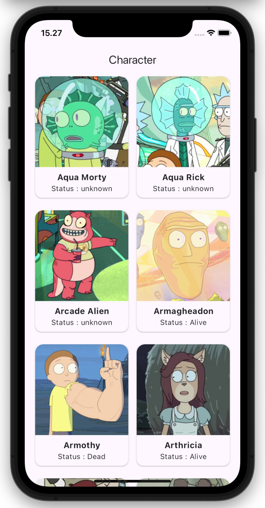

# Rick and Morty app

  Penerapan Clean Architecture Flutter untuk menampilkan list data character dari API <a href="https://rickandmortyapi.com/">Rick & Morty</a>

## Library
- equatable
- dartz
- http
- bloc
- flutter_bloc

## Language and Tools

  
  
  
  
  

## Screenshots

<table>
  <tr>
    <td>Login Screen</td>
  </tr>
  <td>
    
  </td>
</table>
